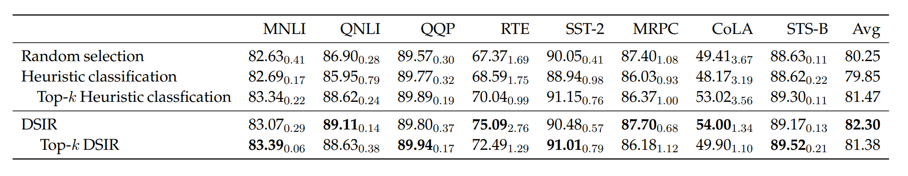
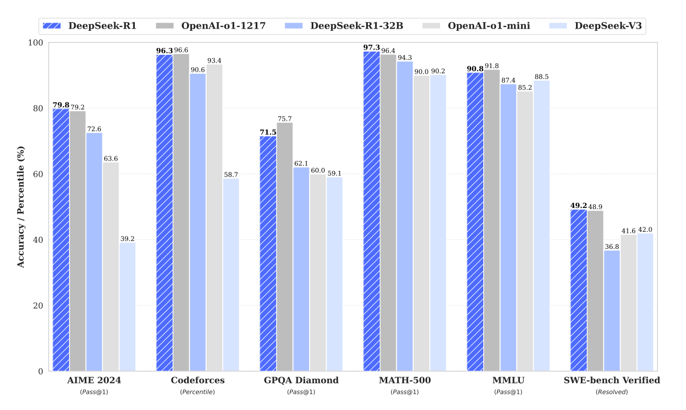

# Lecture-11 Scaling Law（整体综述 v3：开源案例 + 视觉偏离补充）

> 本文保留“实践→理论→实践→未来”四段框架，但定位为 **Scaling Law 的系统综述**（非课堂教案）。主线与 CS336 的 scaling 章节一致：在给定 FLOPs 预算下，用小规模实验拟合规律，再外推到大规模训练配置。

---

## 1. 实践起点（案例 + 经验驱动）

### 1.1 CS336 语境下的核心问题
CS336 在 scaling 小节与 assignment-3 的问题定义非常明确：
- 给定算力预算 \(C\)，如何在参数量 \(N\) 与数据量 \(D\) 间做最优分配；
- 通过小规模采样点拟合缩放规律，再预测更大规模超参数。

主流 dense Transformer 预训练常用近似：

$$
C \approx 6ND
$$

其中 \(N\) 为参数量、\(D\) 为训练 token、\(C\) 为训练 FLOPs。该式是后续 Iso-FLOPs 分析的基础。

### 1.2 从 Kaplan 到 Chinchilla：经验规律的升级
经典联合形式写作：

$$
L(N,D)=E + A N^{-\alpha}+B D^{-\beta}
$$

Kaplan（2020）建立了可外推的幂律框架；Chinchilla（2022）强调在固定计算预算下，许多历史模型“参数偏大、token 偏少”，并推动行业从“单纯加参数”转向“参数/数据协同扩展”。

### 1.3 开源训练案例 A：OLMo 2 的 compute-optimal 证据
OLMo 2（开源权重 + 数据配方 + 训练细节）是非常接近 CS336 课程方法论的案例。其公开图中可读到三点：

1. **Iso-FLOPs 曲线存在稳定 sweet spot**：固定 FLOPs 下，loss 对参数规模呈 U 形，说明“只放大模型”或“只追加数据”都不是最优；
2. **参数/算力近线性对数关系**：在大范围预算内，最优点沿直线移动；
3. **高预算目标点可读**：图中在 \(10^{24}\) FLOPs 量级附近给出约 **63B 参数、1.4T token** 的目标配置，体现了 compute-optimal 的可操作性。

### 1.4 开源训练案例 B：数据工程本身就是 scaling 变量
OLMo2 与 DCLM/DSIR 相关结果显示：现代 scaling 不是只看 token 数量，而是看有效数据 \(D_{eff}\)。

从公开表格可读到：
- OLMo 2 1124 Mix 预训练总量约 **3.90T tokens**；
- 中期高质量子集（Dolmino HQ）约 **832.6B tokens**；
- 数学增强子集约 **10.7B tokens**。

DCLM 过滤图还表明：从原始爬取池到最终可用高质量子集，经过启发式清洗、去重、模型过滤后保留比例大幅下降（图中 model-based filtering 后仅保留很小尾部）。

DSIR 对比表（固定预算）显示下游平均分可优于随机/启发式基线（表中 Avg：DSIR 82.30，高于 Random 80.25 与 Heuristic 79.85），说明 **数据选择策略可改变 scaling 斜率**。

### 1.5 开源/开放权重案例 C：能力提升不等于“只靠预训练 scaling”

DeepSeek-R1 类结果展示了在数学、代码、推理任务上的显著提升，但其增益来源包含后训练（如 RL）与测试时计算策略，提醒我们：
- 经典 pretraining scaling law 主要解释“预训练损失”随 \(N,D,C\) 的变化；
- 端到端能力还受到后训练与推理阶段影响，不能简单等同于一条 \(L(C)\) 曲线。

---

## 2. 理论抽象（从现象到隐式原理）

### 2.1 固定算力下的最优分配
给定

$$
L(N,D)=E + A N^{-\alpha}+B D^{-\beta},\quad C\approx 6ND
$$

可得（忽略常数后）：

$$
N_{opt}(C)\propto C^{\frac{\beta}{\alpha+\beta}},\qquad
D_{opt}(C)\propto C^{\frac{\alpha}{\alpha+\beta}}
$$

以及

$$
L_{opt}(C)=E+K C^{-\gamma},\quad
\gamma=\frac{\alpha\beta}{\alpha+\beta}
$$

这解释了“加算力仍降损失，但边际收益递减”的普遍现象。

### 2.2 从 \(D\) 到 \(D_{eff}\)：质量导向的扩展
现实训练中，token 并不等价。更贴近工程事实的写法是：

$$
L \approx E + A N^{-\alpha}+B D_{eff}^{-\beta}+\Delta_{obj}+\Delta_{opt}
$$

- \(D_{eff}\)：去重、重加权、领域覆盖后“有效可学习”的数据规模；
- \(\Delta_{obj}\)：预训练目标/对比损失/蒸馏目标差异；
- \(\Delta_{opt}\)：优化器、学习率日程、并行效率导致的有效算力偏差。

因此，很多“看似不遵循 scaling law”的现象，本质是变量被替换而非幂律彻底失效。

### 2.3 loss scaling 与能力 scaling 并非同一条曲线

能力指标（准确率、任务成功率）常出现阈值效应/台阶跃迁；而 token-level loss 往往更平滑。结论是：
- **loss 更适合做可预测外推**；
- **能力更适合做分阶段、分任务建模**。

### 2.4 从训练最优到全生命周期最优
产业目标通常是：

$$
C_{total}=C_{train}+\lambda C_{infer}
$$

当推理流量巨大时，训练阶段的 Chinchilla 最优点不一定等于产品最优点；这也是近年 inference-aware scaling 与后训练 scaling 被单独研究的原因。

---

## 3. 再回到实践（跨模型类比与训练工程）

### 3.1 为什么“自监督视觉模型似乎不遵循经典 scaling law”
当前社区常见观察并非“完全不遵循”，而是“**不满足 NLP 里那种单一稳定幂律**”。主要原因包括：

1. **目标函数错位**：
   视觉 SSL（对比学习/蒸馏/掩码重建）的 pretext loss 与下游分类/检测/检索指标相关性不稳定。

2. **有效样本增长更快饱和**：
   图像数据重复度高、语义长尾稀疏，导致 \(D\) 增长不等于 \(D_{eff}\) 同比例增长。

3. **增强策略本身改变任务定义**：
   crop、color jitter、多视角蒸馏会改变“模型看到的数据分布”，因此同样 FLOPs 下的学习难度不可比。

4. **评测协议依赖后处理**：
   线性探针、全量微调、分辨率迁移、prompt/adapter 选择会显著改变最终曲线形状。

5. **计算定义不再简单是 \(6ND\)**：
   多裁剪、教师-学生、分辨率动态调度使“每 token 计算成本”在视觉 SSL 中明显非恒定。

### 3.2 这不意味着视觉 SSL 没有 scaling，而是需要“条件化 scaling”
更合理的表述是：
- 固定目标函数、增强策略、评测协议后，局部区间仍可拟合幂律；
- 跨协议/跨目标迁移时，指数与常数项会发生结构性变化；
- 因此应采用分段或分阶段模型，而非单一全局指数。

### 3.3 与 DINOv2/v3 经验的对应关系
DINO 系列的实践结论与上述机制一致：
- 高质量数据与严格清洗是收益前提；
- 教师质量与训练稳定性会直接影响“可扩展性上限”；
- 当目标与评测不对齐时，继续增加算力可能只降低 pretext loss，而下游收益趋缓。

### 3.4 按 CS336 方法重建视觉 scaling 的可执行流程
可直接复用 CS336 assignment-3 思路，但把变量扩展到视觉语境：

1. 在多个 \((N,D,\text{resolution},\text{augmentation})\) 点采样；
2. 先拟合 pretext loss，再拟合下游指标；
3. 引入 \(D_{eff}\)（去重率、语义覆盖度、难样本占比）替代原始样本量；
4. 进行跨预算外推并做反事实验证（只改数据质量、不改 token 数）。

---

## 4. 未来问题与发展（实践-理论闭环）

### 4.1 统一“等效 token / 等效 compute”度量
多模态（文/图/音）信息密度差异极大，需要统一等效单位，才能让跨模态 iso-loss 预测成立。

### 4.2 预训练、后训练、推理三阶段联合 scaling
未来主流目标不再是单一 \(L(C)\)，而是联合优化：
- 预训练：决定知识底座与损失斜率；
- 后训练：决定能力投影方向（对齐、推理、工具调用）；
- 推理阶段：决定在真实流量下的能力兑现率与成本。

### 4.3 视觉自监督的关键突破点
- 构建与下游性能更一致的代理目标；
- 将增强策略纳入显式资源模型；
- 用数据谱系（来源、重复、难度）替代“纯样本计数”。

### 4.4 对当前工程最有价值的结论
1. **先拟合，再放大**（CS336 核心思想）；
2. **数据质量是 scaling 变量，不是噪声项**；
3. **视觉 SSL 要用条件化/分段 scaling，而非照搬 NLP 单公式**；
4. **评估要覆盖训练后与推理时成本，避免只优化训练损失**。

---

## 参考资料（公开论文 / 报告 / 课程）
- Kaplan et al., *Scaling Laws for Neural Language Models* (2020)
- Hoffmann et al., *Training Compute-Optimal Large Language Models* (Chinchilla, 2022)
- Henighan et al., *Scaling Laws for Autoregressive Generative Modeling* (2020)
- Wei et al., *Emergent Abilities of Large Language Models* (2022)
- OLMo / OLMo2 公开技术报告与配套数据说明（Allen Institute for AI）
- DINOv2 及后续视觉自监督公开报告（Meta AI）
- CS336 课程 scaling 章节与 assignment-3（small-scale fit → large-scale extrapolation）
- 参考综述链接（用户提供）：https://zhuanlan.zhihu.com/p/1937836415372207030

